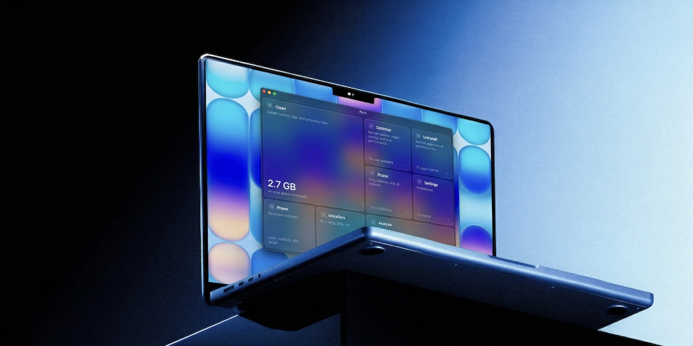

<div align="center">
  

  <h1>Kyra</h1>

  <p><strong>Nine lives for your storage.</strong></p>

  <p>A fast, beautiful macOS app that cleans junk, reclaims disk space,<br />and keeps your Mac running smoothly.</p>

  <p>
    <a href="https://github.com/0xjba/Kyra/releases/latest"></a>
    
    
    <a href="https://github.com/0xjba/Kyra/blob/main/LICENSE"></a>
    
  </p>

  <p>
    <a href="https://github.com/0xjba/Kyra/releases/latest">Download</a> &nbsp;&middot;&nbsp;
    <a href="https://github.com/0xjba/Kyra/blob/main/CHANGELOG.md">Changelog</a> &nbsp;&middot;&nbsp;
    <a href="https://github.com/0xjba/Kyra/blob/main/LICENSE">License</a>
  </p>
</div>

<br />

<p align="center"></p>

## Features

- **Clean** — Scan and remove system caches, user caches, logs, browser data, and orphaned app files
- **Prune** — Find and bulk-delete developer artifacts like `node_modules`, `target`, `__pycache__`, and `.build` across all your projects
- **Installers** — Locate leftover `.dmg`, `.pkg`, and `.iso` files sitting in your Downloads
- **Uninstall** — Fully remove apps along with their support files, caches, and preferences
- **Optimize** — Run system maintenance tasks like flushing DNS, rebuilding LaunchServices, and vacuuming databases
- **Analyze** — Treemap disk visualizer, large file finder, and duplicate file detector
- **Status** — Real-time CPU, memory, disk, and network monitoring
- **Ask AI** — Not sure if something is safe to delete? Ask AI opens ChatGPT with your scan results for a second opinion

## Install

1. Download the latest `.dmg` from [**Releases**](https://github.com/0xjba/Kyra/releases/latest)
2. Open the `.dmg` and drag Kyra to your Applications folder
3. Launch Kyra — the onboarding will guide you through setup

> [!NOTE]
> Kyra is not yet notarized by Apple. On first launch macOS may show "Kyra is damaged." To fix this, go to **System Settings → Privacy & Security**, scroll down and click **Open Anyway**. Or run `xattr -cr /Applications/Kyra.app` in Terminal.

## Build from source

```bash
git clone https://github.com/0xjba/Kyra.git
cd Kyra
npm install
npm run tauri dev
```

Requires [Node.js](https://nodejs.org/) 22+ and [Rust](https://rustup.rs/).

<details>
<summary>Production build</summary>

```bash
npm run tauri build -- --target aarch64-apple-darwin
```

</details>

## Tech

<p>
  
  
  
  
</p>

## License

[MIT](LICENSE) — made by [Jobin Ayathil](https://github.com/0xjba)
